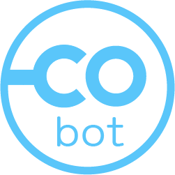
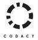
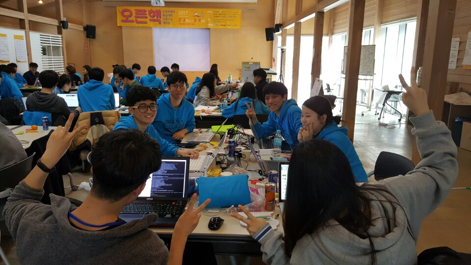
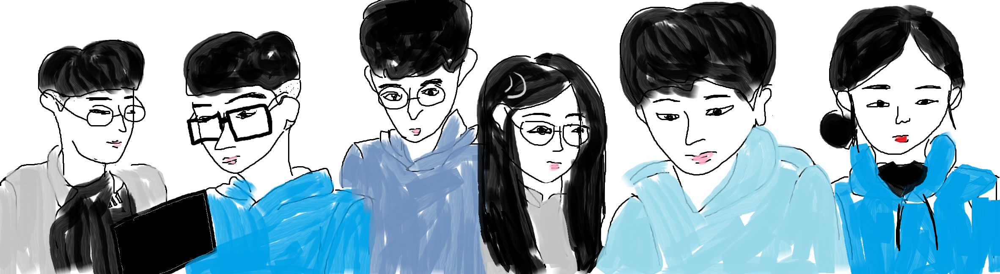

----

<!-- TOC depthFrom:1 depthTo:1 withLinks:1 updateOnSave:1 orderedList:0 -->

- [Dashboard - 오픈핵](#dashboard)
- [COBot - Korean](#cobot-korean)

<!-- /TOC -->

----

# <a name="dashboard">Dashboard - 오픈핵

> 소프트웨어 중심대학 오픈소스 해커톤 관련 내용 정리

### 해커톤 공지

* 주최: 한국정보과학회 오픈소스소프트웨어 연구회(http://sigoss.github.io)

* 참여학교: 12개 소프트웨어 중심대학 (고려대,국민대,동국대,부산대,서강대,서울여대,성균관대,세종대,아주대,충남대,한양대,KAIST )

* 일시: 2월 2일 (목) ~ 2월 4일 (토) : 목요일 오후 ~ 토요일 오후

* 장소: 서울시립대 강촌 수련원

---

  

# <a name="cobot-korean">COBot </a>  

## 밀폐공간 작업자들의 질식사고 예방을 위한 일산화탄소 측정/경보 어플리케이션  

> CO Bot은 밀폐공간 내 작업자들의 질식사고 예방을 위한 일산화탄소 측정 / 경보 어플리케이션 제공을 목표로 합니다.

---

## Overview

## Developer
 * 강성필 - 성균관대학교
 * 김문태 - 부산대학교
 * 김효준 - 세종대학교
 * 변소현 - 서울여자대학교
 * 송승현 - 충남대학교
 
## Designer
 * 김소진 - 성균관대학교

